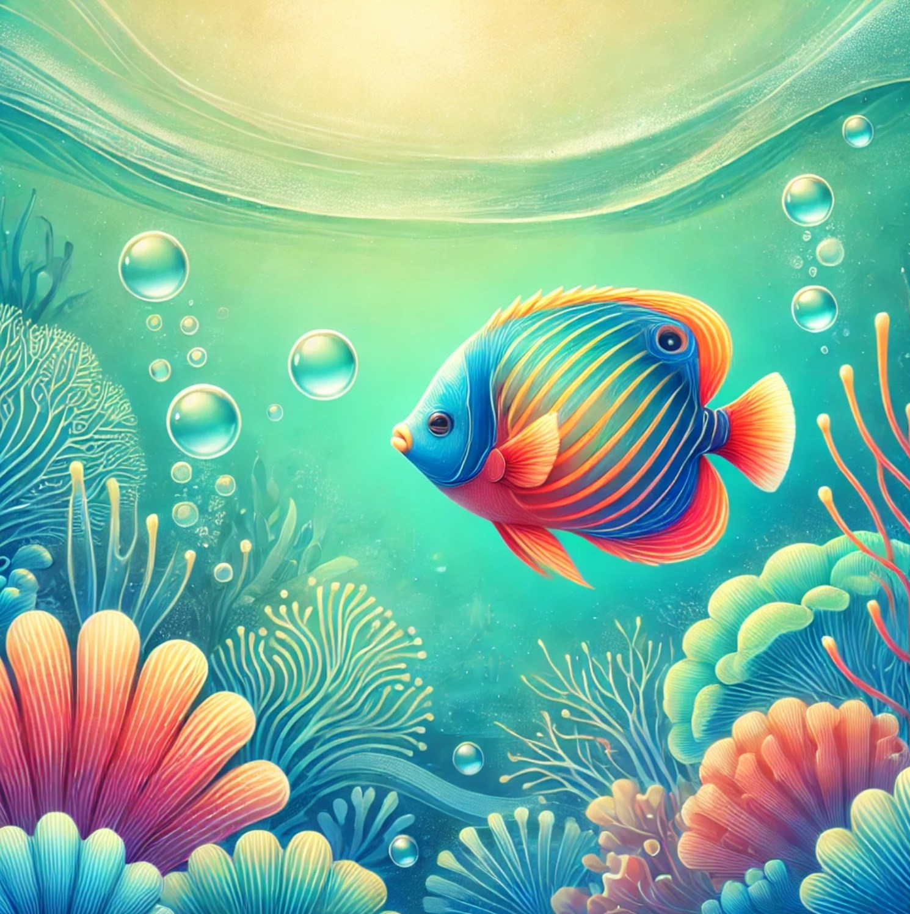
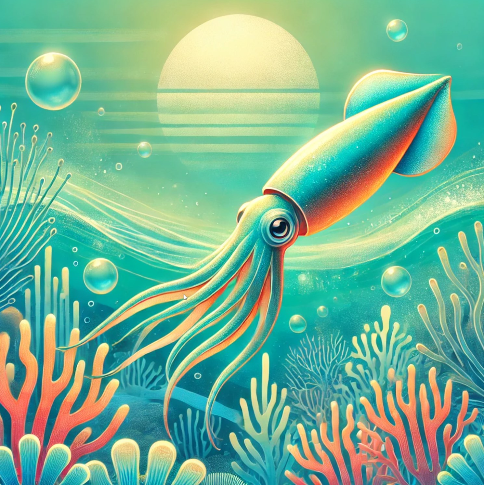

# Interactive Animation Website

## Overview
This project is an interactive website featuring animations for text and images using **GSAP** and **ScrollTrigger**. It demonstrates complex scroll-based animations, including parallax effects, text animations, and image transitions.

## Features
- **Parallax effect**: The background of the hero section has a fixed parallax effect as you scroll.
- **Text animations**: Headings and subtitles animate with smooth transitions when the page loads.
- **Image transitions**: Images in the gallery appear with a scaling and opacity effect as you scroll through the page.
- **Scroll-triggered animations**: The animations for text and images are activated as the user scrolls down the page.

## Technologies
- **HTML5** for the page structure.
- **CSS3** for layout and basic styles.
- **GSAP (GreenSock Animation Platform)** for animations.
- **ScrollTrigger** for triggering animations on scroll.

## How to Run the Project
1. Clone the repository:
   ```bash
   git clone <repository_url>
   ```
2. Place your images in the **`images`** folder with names like `1.jpg`, `2.jpg`, etc.
3. Update the HTML code to include these images in your gallery:
    ```html
    <section class="gallery">
      <div class="gallery-item">
        
      </div>
      <div class="gallery-item">
        
      </div>
      <div class="gallery-item">
        
      </div>
    </section>
    ```
4. Open the project folder and start a live server (for example, using **Live Server** in VSCode) or open `index.html` directly in your browser.

## Code Highlights
- **GSAP and ScrollTrigger for scroll animations**:
  ```javascript
  gsap.utils.toArray(".image-item img").forEach((image) => {
    gsap.fromTo(image, 
      { opacity: 0, scale: 0.8 }, 
      { 
        opacity: 1, 
        scale: 1, 
        scrollTrigger: {
          trigger: image,
          start: "top 80%",
          end: "bottom 20%",
          scrub: true,
          toggleActions: "play none none reverse"
        }
      });
  });
  ```

- **Text animations on page load**:
  ```javascript
  gsap.fromTo(".hero-title", { opacity: 0, y: 50 }, { opacity: 1, y: 0, duration: 1.5, ease: "power2.out" });
  gsap.fromTo(".hero-subtitle", { opacity: 0, y: 50 }, { opacity: 1, y: 0, duration: 1.5, ease: "power2.out", delay: 0.5 });
  ```

## Live Demo
[[Click here to view the live demo](#)](https://alex-borisov92.github.io/animation-gasp-modified)
